Basic tasks

Use ansible modules to create a user along with

Home directory as /tmp/username

Provide shell /bin/bash

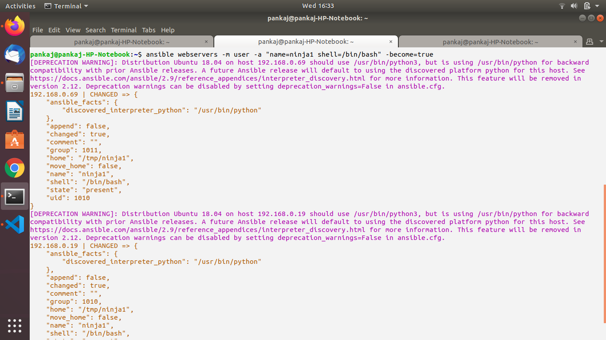

Create a group for user

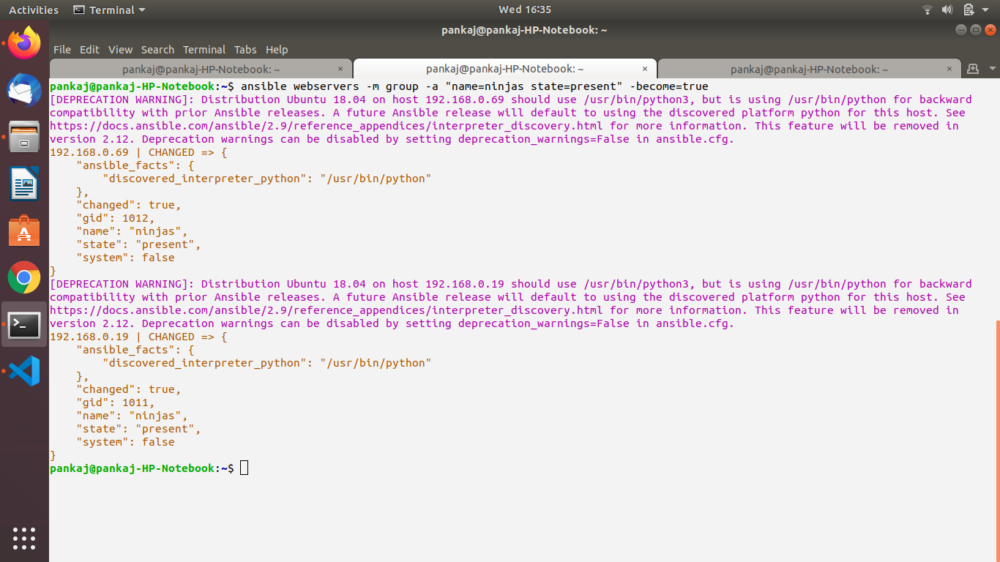

Associate that user with newly created group

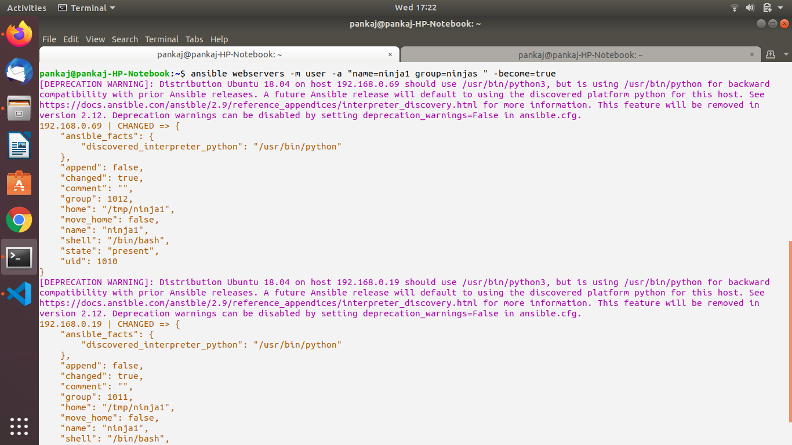

Use ansible modules to fetch system info like

Hostname

IP addresses (public, private)

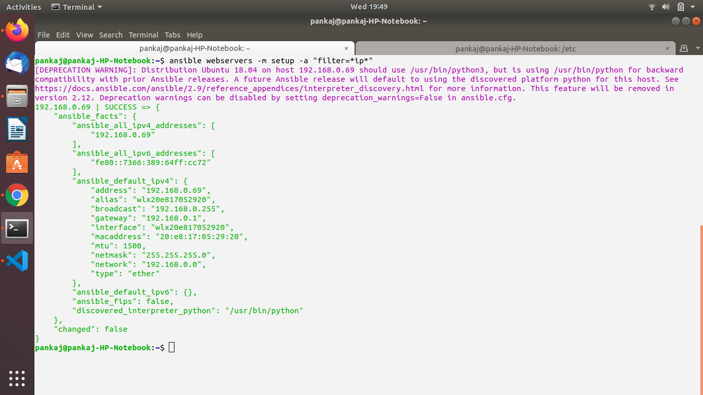

Operating System

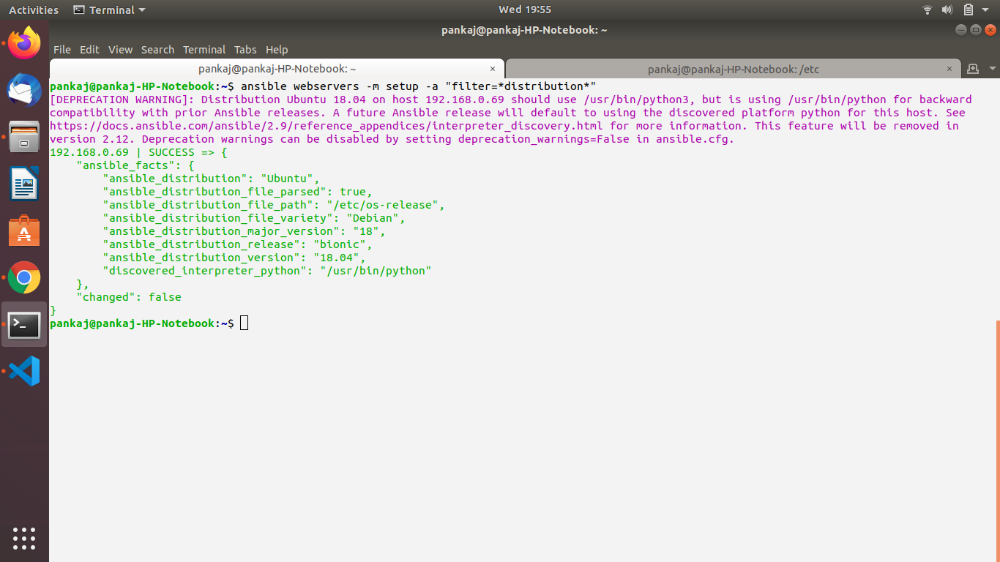

RAM information (total, used, free)

Disk information (total,used, free)

Available Network Devices.

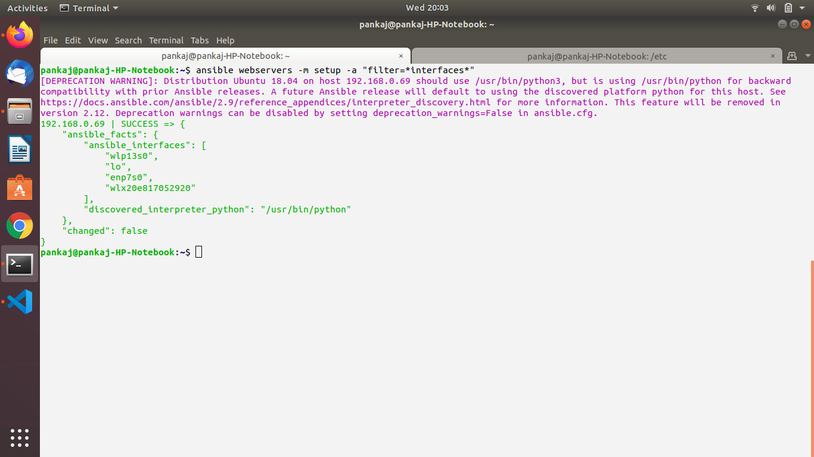

Use ansible modules to install nginx along with below steps.

Start nginx service

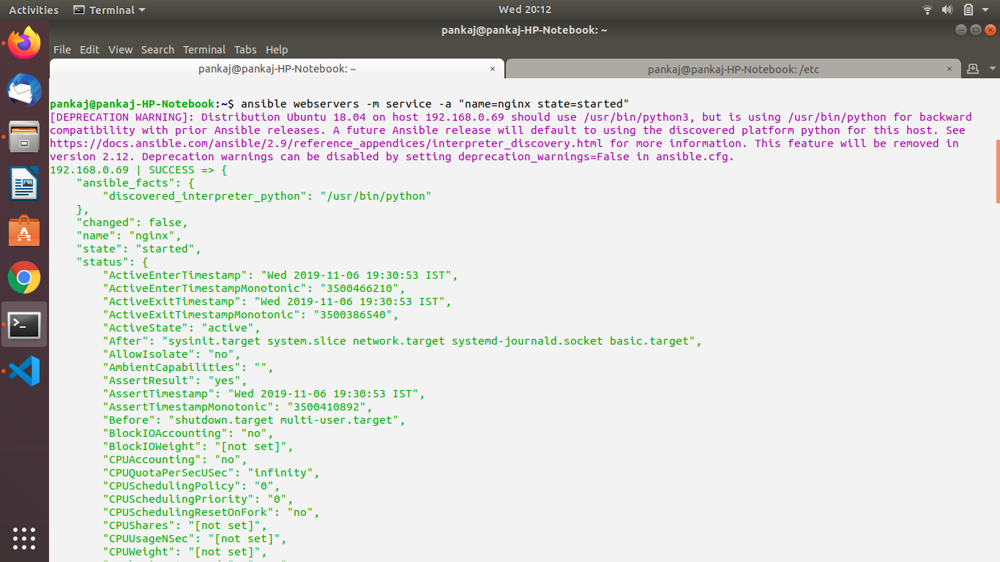

Stop nginx service

Along with hosting a custom HTML Page on it displaying your Name. /var/www/html/index.nginx-debian.html

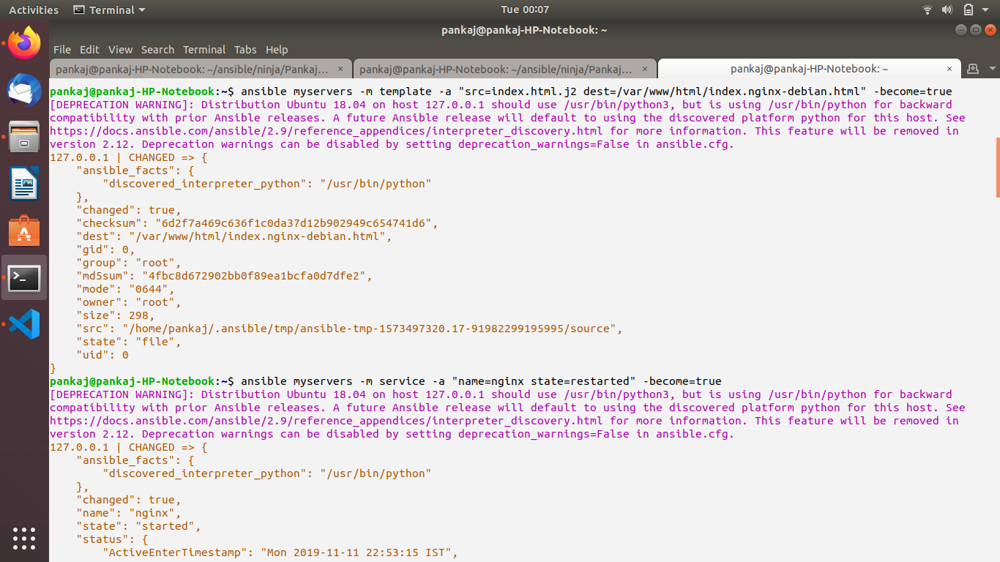

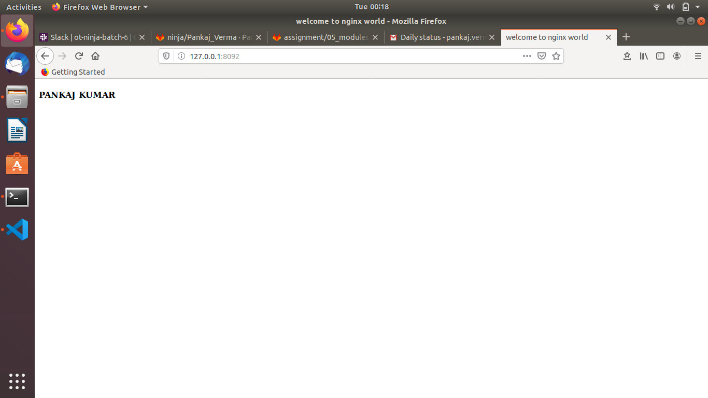

Restart nginx service

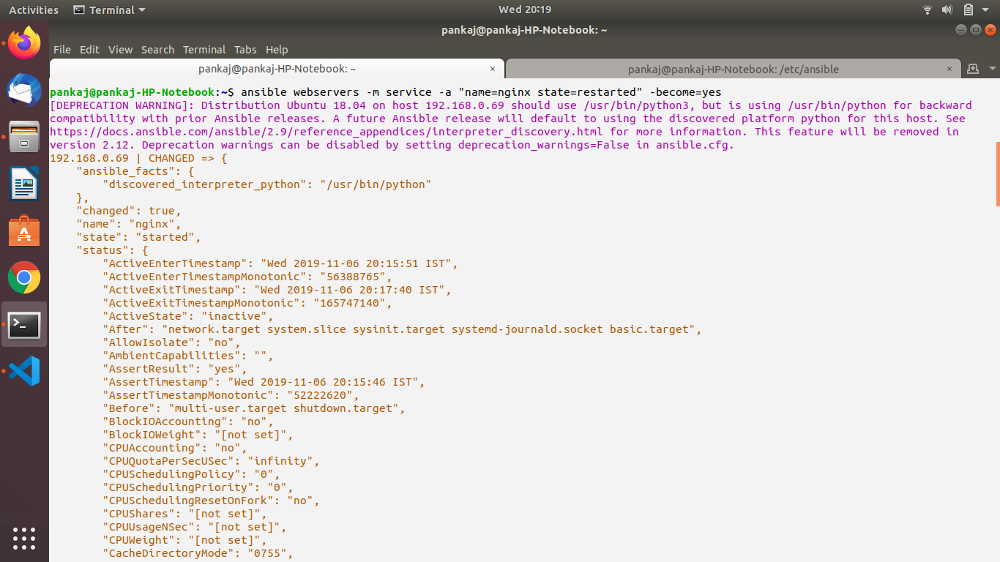

Note: For this assignment create a user ninja having sudo privileges on your machine.
Make sure that all below listed operations should be done via ansible adhoc command using ninja user

Must Do

Install python3 on your machine.

Print operating system of your machine.

Install nginx.

Host https://github.com/cloudacademy/static-website-example via nginx.

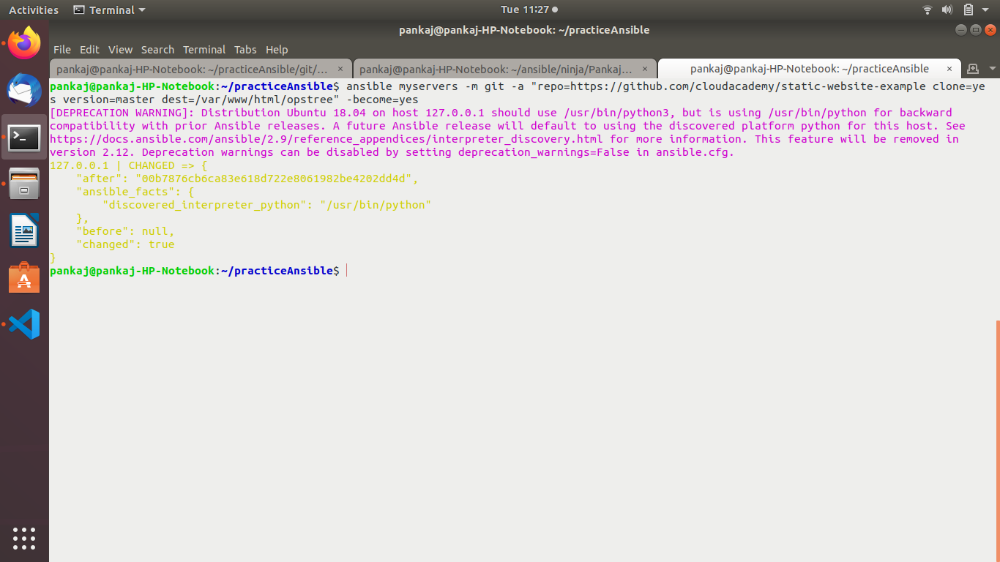

Host above website as opstree.com, make sure the logs should be stored as /var/log/nginx/opstree.com.access.log and /var/log/nginx/opstree.com.error.log

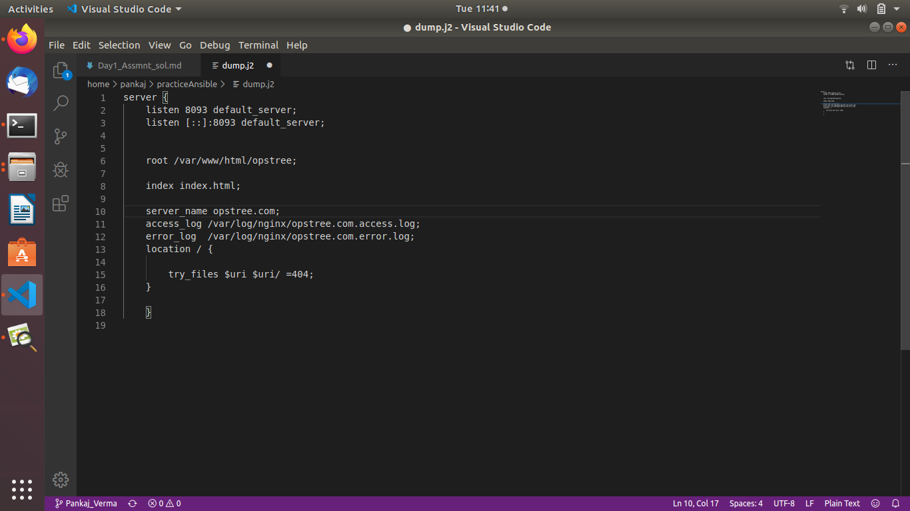

Host abvoe website as techprimosoultions.com, make sure the logs should be stored as /var/log/nginx/techprimosoultions.com.log and /var/log/nginx/techprimosoultions.com.error.log

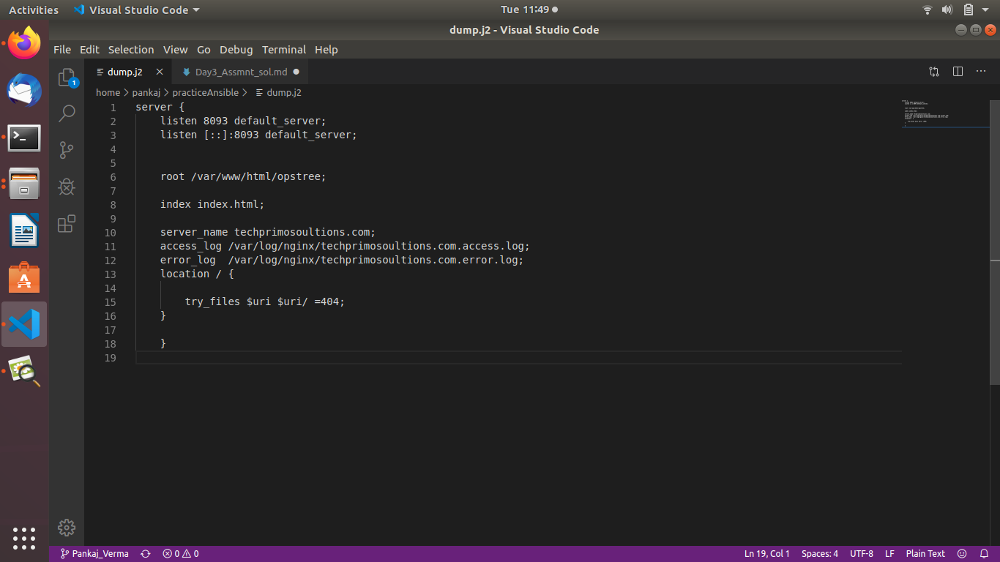

Make sure that the hosted website is accessible only from localhost

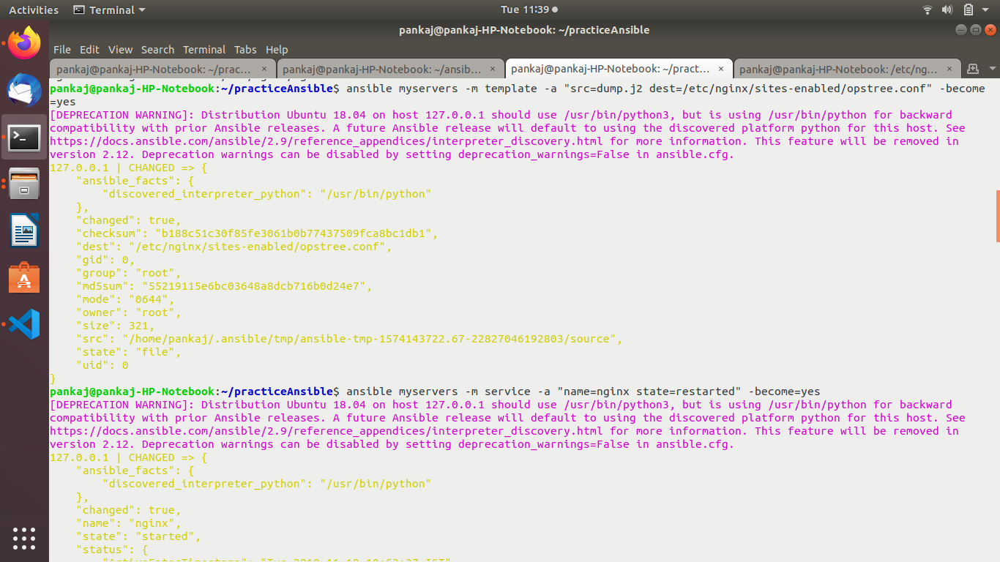

Create a utility that will run every morning at 9:30 am that will clean up the nginx logs.

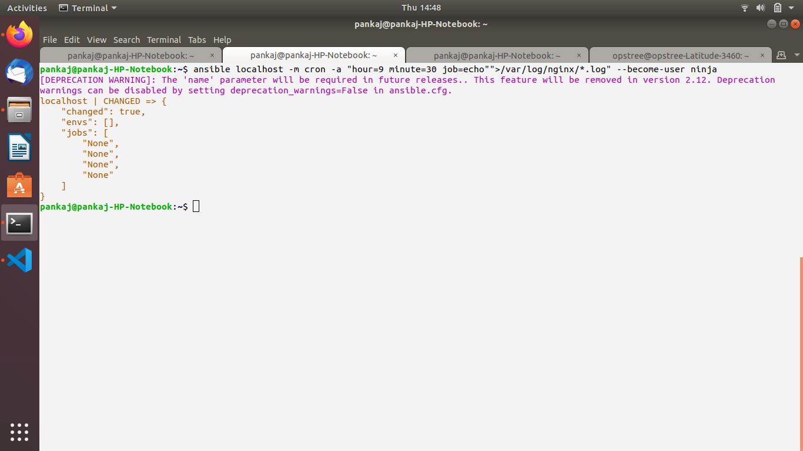

Good to do

Uninstall python from your machine

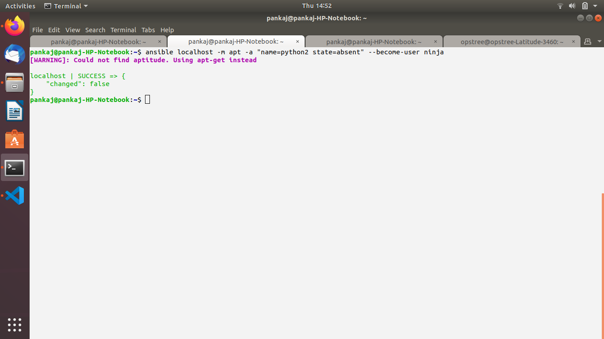

Install python3 on your machine.

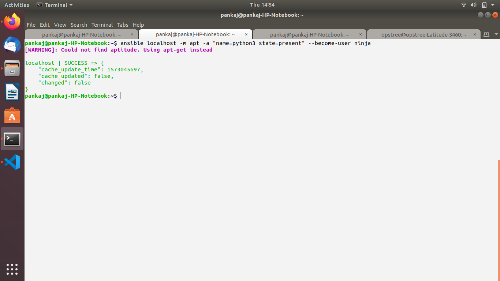

Uninstall nginx

Install nginx using nginx binary or source code. Follow Linux best practices

Summary
In this section we have gone through some of the important ansible modules

raw
apt, yum, package
git
shell, command
service
user
group
file, copy
template
lineinfile
unarchive
iptables
script
stat
setup