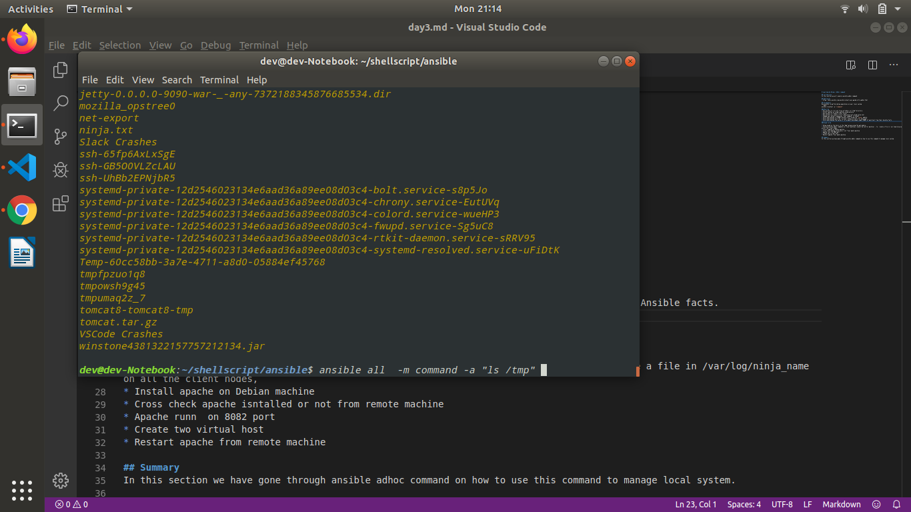
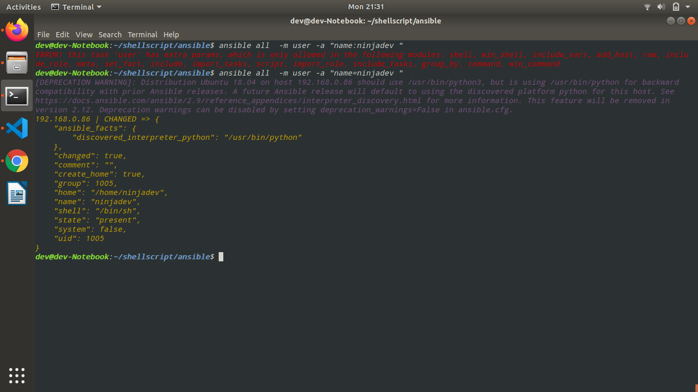
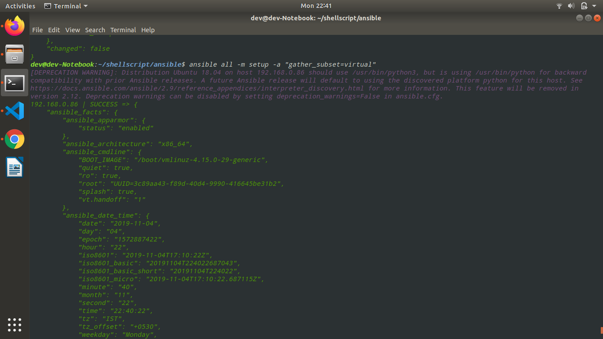

# Learning by Doing | Adhoc command

## Introduction
In this section we will explore ansible adhoc command

## References
* https://docs.ansible.com/ansible/latest/user_guide/intro_adhoc.html

## Assignments
Use ansible to perform below operations on your local system
```bash
ansible localhost -a "<command>"
```
### Must Do
* Use ansible to list out files & folders in */tmp* directory.

* Install python on target machine using ansible.

``` ansible all  -m apt -a "name=python state=latest"```

* Use ansible to Create a *user ninja*



* Use ansible to create a file */tmp/ninja.txt* using ninja user.


* Change your default execution from *command* to *ping*.
``` ansible all -m ping ```
* Fetch and display to STDOUT Ansible facts using the `setup` module.


* Fetch and display only the "virtual" subset of facts for each host.


* Fetch and display the value of fully qualified domain name (FQDN) of each host from their Ansible facts.

### Good to Do

* Setup Java8 on the hosts in the "App" group using the apt module.
* execute ansible adhoc commands on client machines (cannot be control machine) , to  create a file in /var/log/ninja_name on all the client nodes,
* Install apache on Debian machine
* Cross check apache isntalled or not from remote machine
* Apache runn  on 8082 port
* Create two virtual host
* Restart apache from remote machine

## Summary
In this section we have gone through ansible adhoc command on how to use this command to manage local system.
