# Learning by Doing | Modules

## Introduction
In this section we will explore various ansible modules and understand how we can self learn a module

## References
* https://docs.ansible.com/ansible/latest/modules/modules_by_category.html

## Assignments
For this assignment we will use the setup created in our previous assignment

### Basic tasks

* Use ansible modules to create a user along with
	* Home directory as /tmp/username

    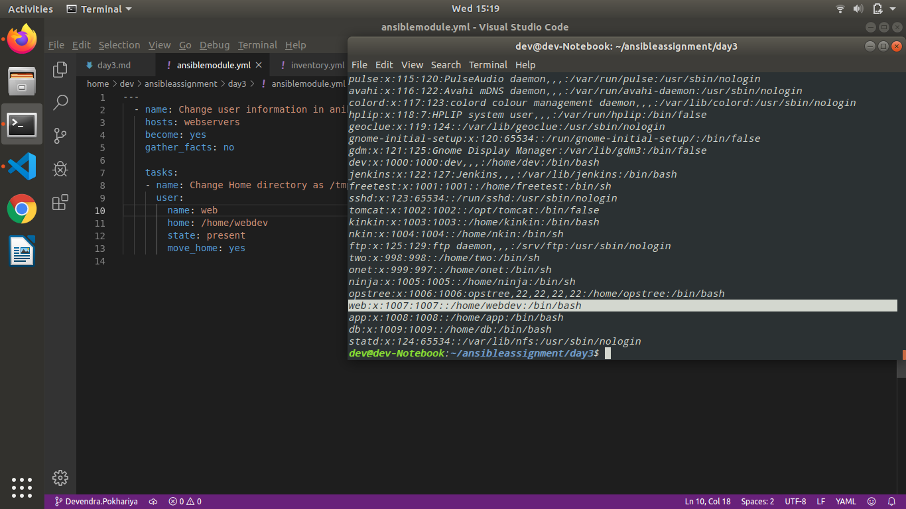

	* Provide shell /bin/bash

    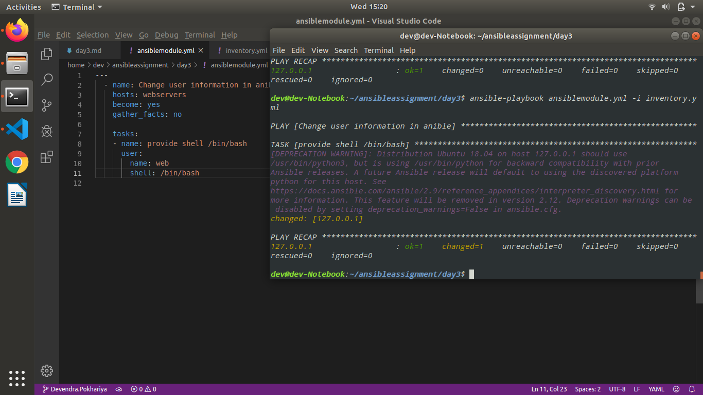

	* Create a group for user && Associate that user with newly created group
    
    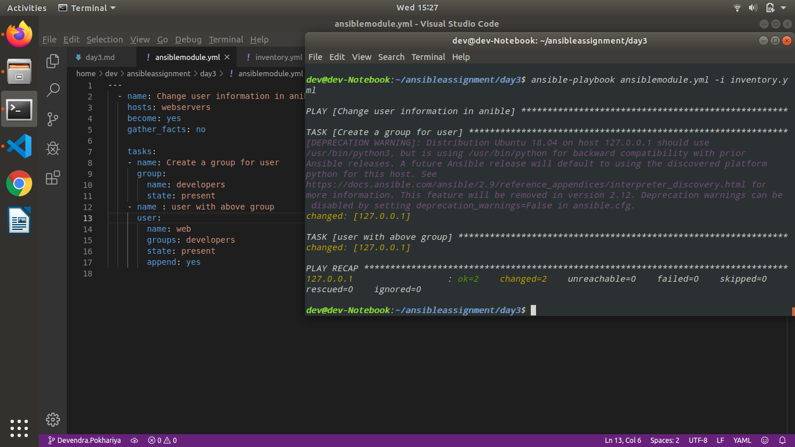
    
  

* Use ansible modules to fetch system info like
	* Hostname

	```ansible all -i inventory.yml -m setup -a"filter=*hostname*"```
	
	
	
	* IP addresses (public, private) 

	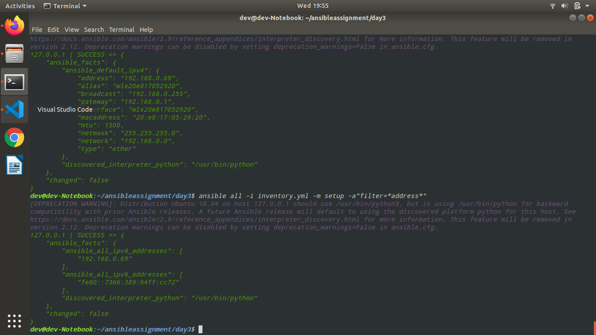

	* Operating System
	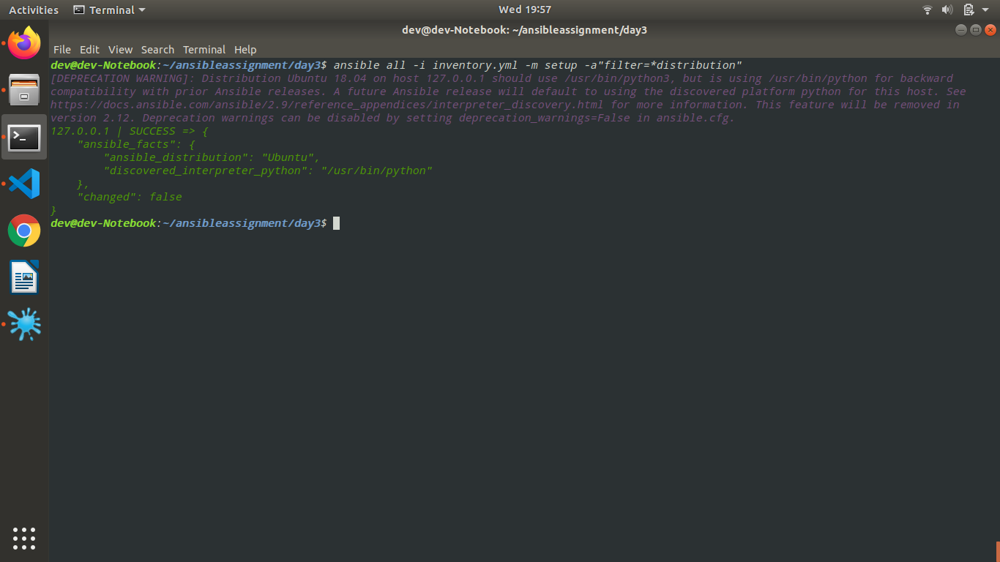

	* RAM information (total, used, free)

	

	* Disk information (total,used, free)

	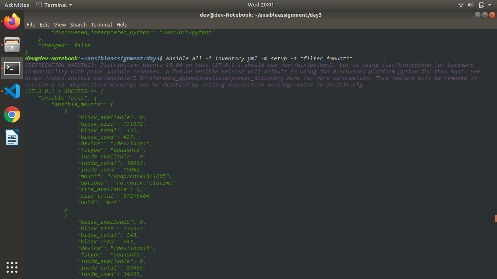

	* Available Network Devices.
	

* Use ansible modules to install nginx along with below steps.
	* Start nginx service 

	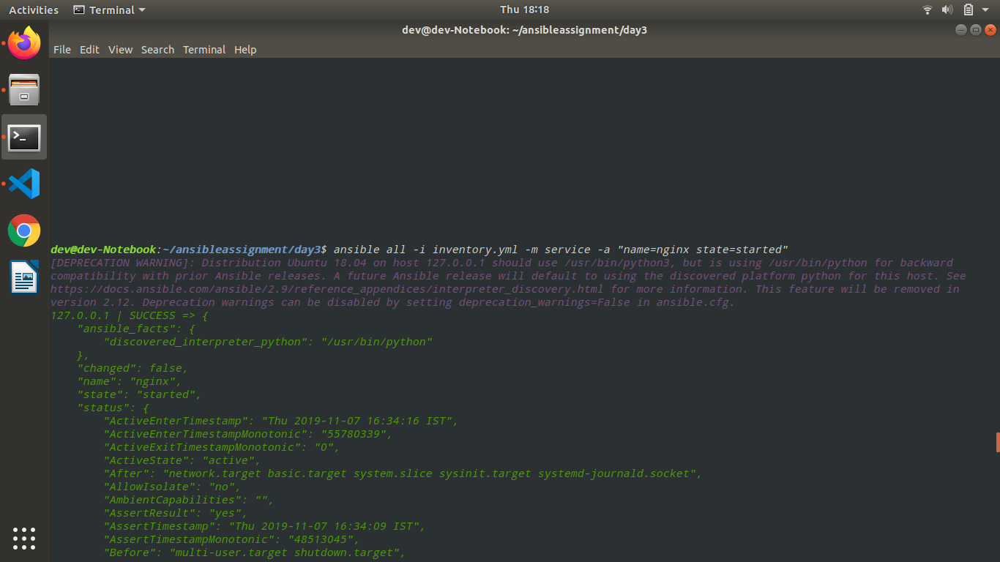

	* Stop nginx service
	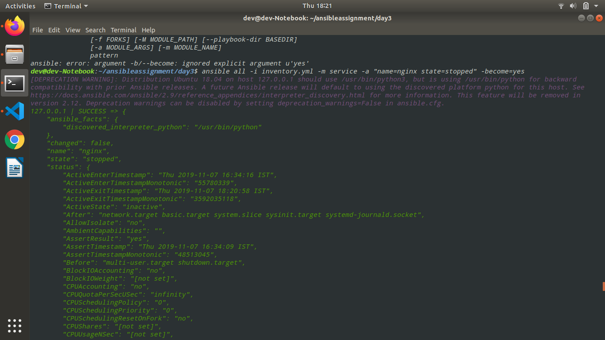

	* Along with hosting a custom HTML Page on it displaying your Name. `/var/www/html/index.nginx-debian.html`

	```ansible all -i inventory.yml -m template -a "src=site.conf dest=/etc/nginx/sites-available/site.conf" -m template -a"src=index.nginx-debian.html dest=/var/www/html/index.nginx-debian.html" -m file -a "src=/etc/nginx/sites-available/site.conf dest=/etc/nginx/sites-enabled/site.conf state=link" -m service -a "name=nginx state=restarted" -become=yes```

	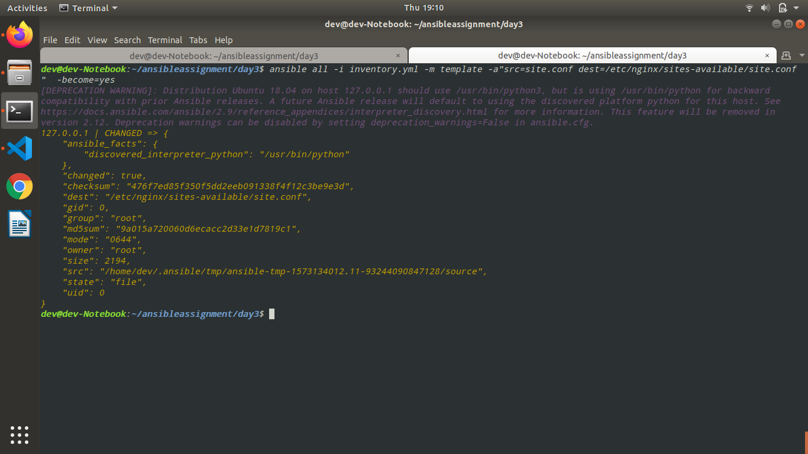
	
	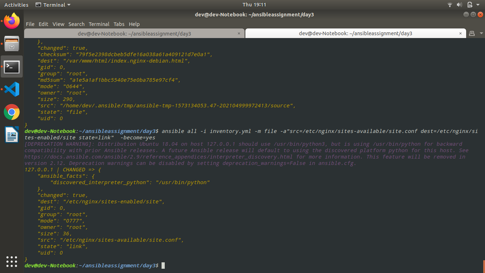
	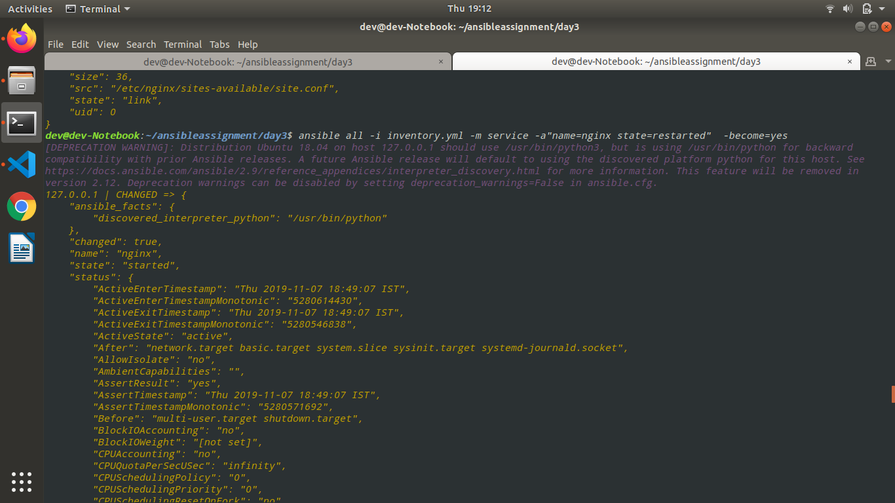
	
	* Restart nginx service

	

> Note: For this assignment create a user ninja having sudo privileges on your machine. 
> Make sure that all below listed operations should be done via **ansible adhoc command** using *ninja* user


### Must Do 

* Install *python3* on your machine.

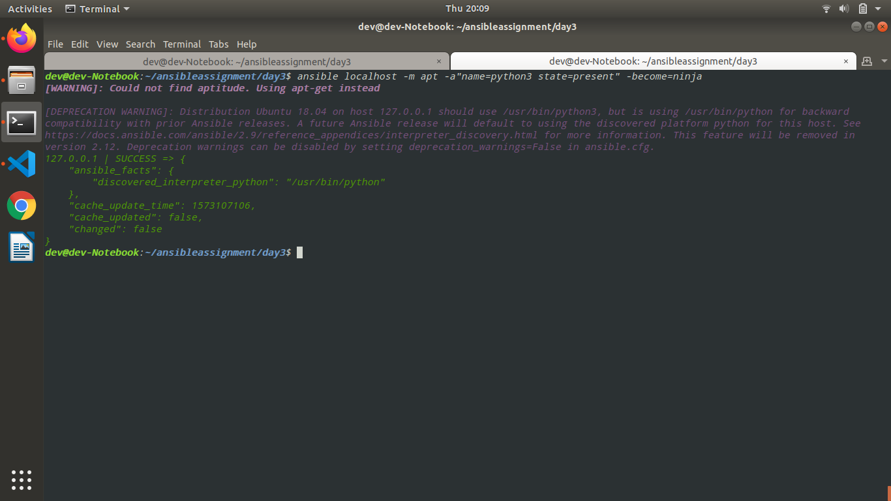

* Print operating system of your machine.


* Install *nginx*.


* Host *https://github.com/cloudacademy/static-website-example* via *nginx*.

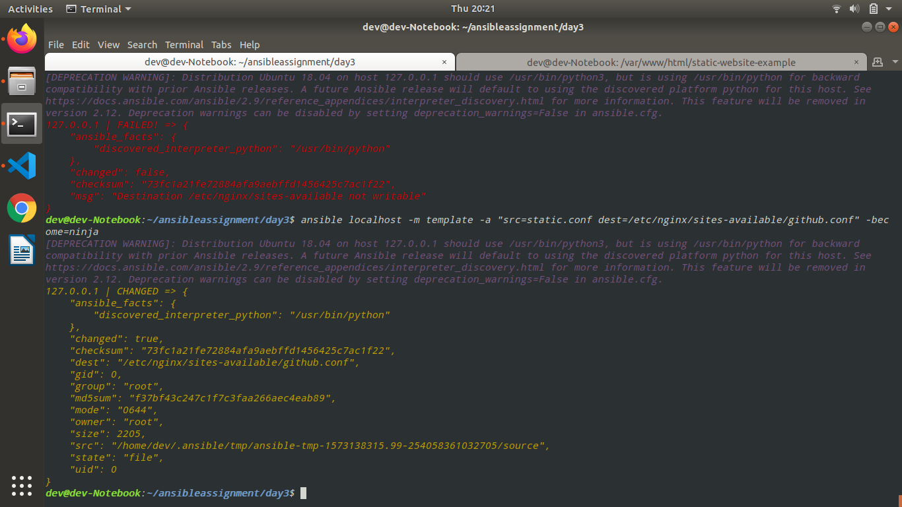

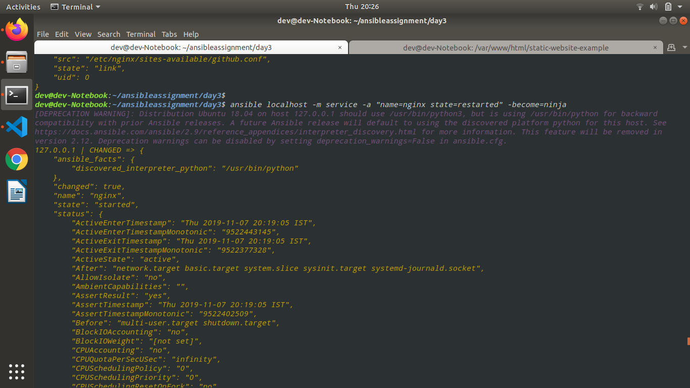
* Host above website as *opstree.com*, make sure the logs should be stored as */var/log/nginx/opstree.com.access.log* and */var/log/nginx/opstree.com.error.log*


* Host abvoe website as *techprimosoultions.com*, make sure the logs should be stored as */var/log/nginx/techprimosoultions.com.log* and */var/log/nginx/techprimosoultions.com.error.log*

* Make sure that the hosted website is accessible only from *localhost*

* Create a utility that will run every morning at 9:30 am that will clean up the nginx logs.


## Good to do
* Uninstall python from your machine

* Install *python3* on your machine.

* Uninstall nginx

* Install nginx using nginx binary or source code. Follow Linux best practices


## Summary
In this section we have gone through some of the important ansible modules

* raw
* apt, yum, package
* git
* shell, command
* service
* user
* group
* file, copy
* template
* lineinfile
* unarchive
* iptables
* script
* stat
* setup