# Assignment Solution by Prajul Chauhan

## Basic tasks

* Use ansible modules to create a user along with
	* Home directory as /tmp/username
	* Provide shell /bin/bash
	* Create a group for user
	* Associate that user with newly created group

	
	ansible localhost -m user -a "name=ninja1 home=/tmp/ninja shell=/bin/bash" --become

	
	

	ansible localhost -m shell -a "groupadd=test" --become

	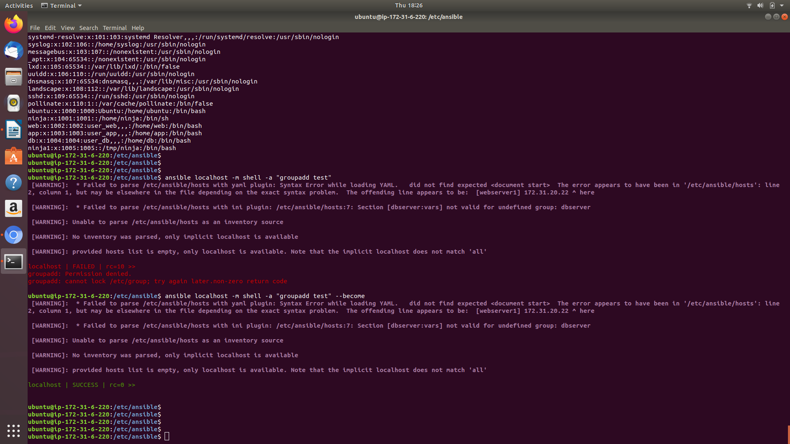

	
	ansible localhost -m user -a "name=ninja1 group=tests" --become

	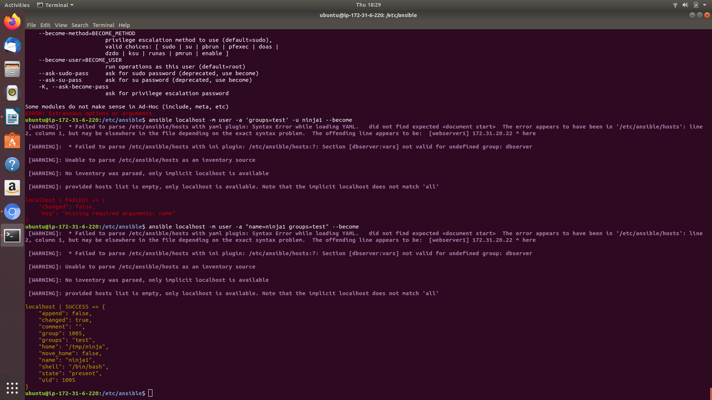
 

* Use ansible modules to fetch system info like

	* Hostname

	ansible webserver1 -m setup -a "filter=*hostname*"
	
	
	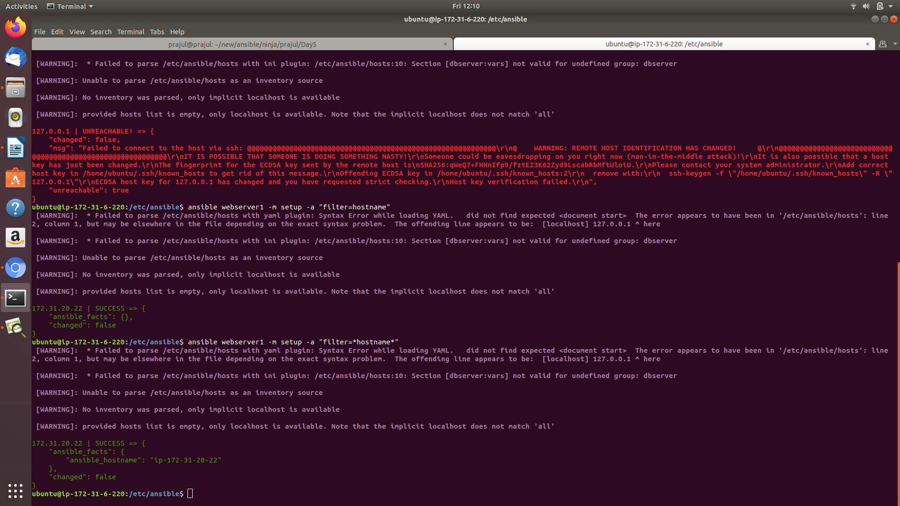

	* IP addresses (public, private) 

	ansible webserver1 -m setup -a "filter=*ip*"

	
	

	* Operating System

	ansible webserver1 -m setup -a ""filter=*distribution*

	
	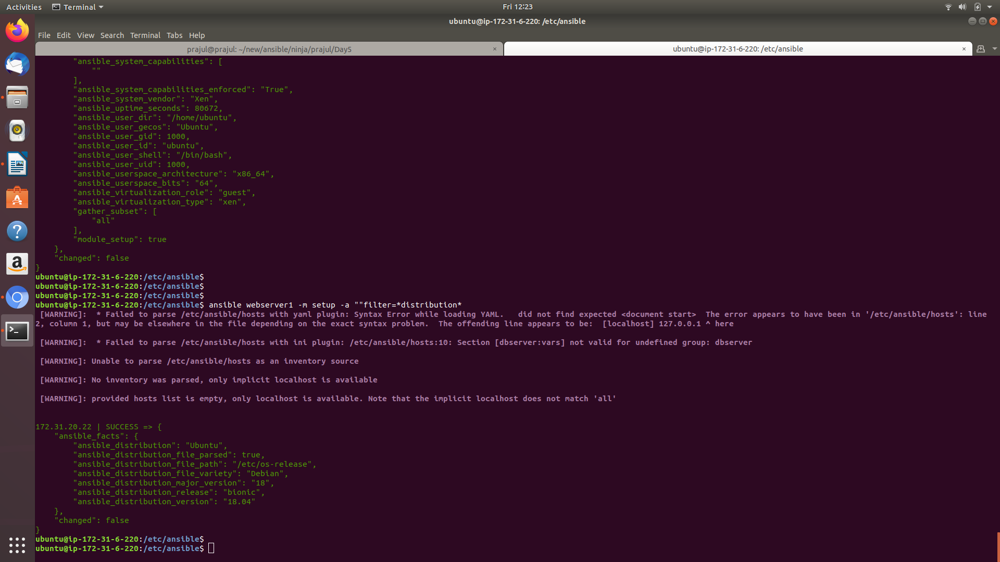

	* RAM information (total, used, free)

	ansible webserver -m setup -a "filter=*memory*"

	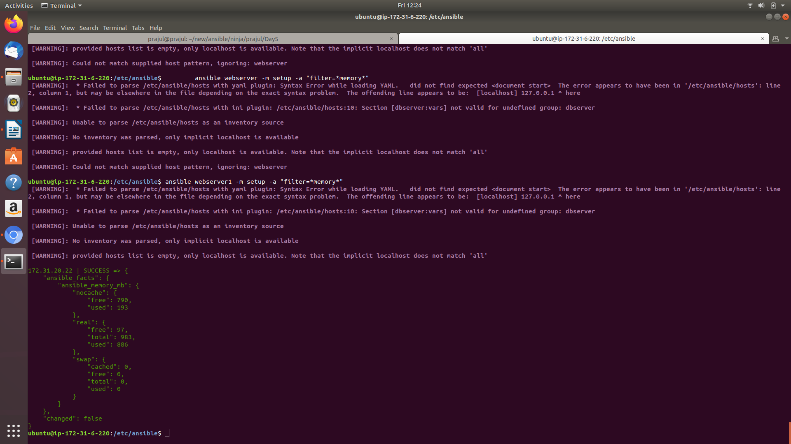

	* Disk information (total,used, free)

	ansible webserver1 -m setup -a "filter=*ansible_mounts*"

	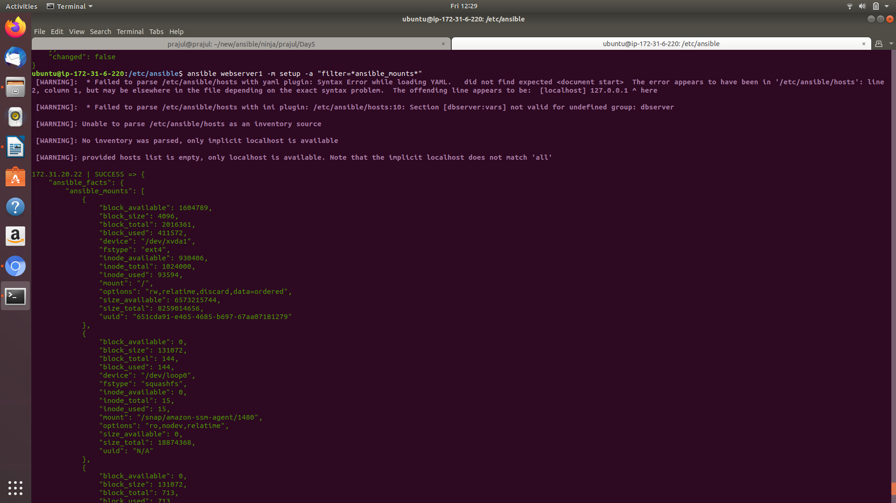

	* Available Network Devices.

	
	ansible webserver1 -m setup -a "filter=*ansible_eth0*"

	
	

* Use ansible modules to install nginx along with below steps.

	ansible webserver1 -m apt -a "name=nginx update_chache=yes state=latest " --become

	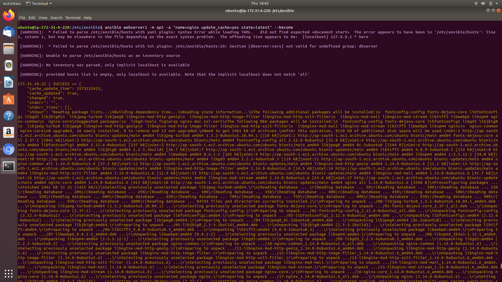

	* Start nginx service 

	
	ansible webserver1 -m service -a "name=nginx state=started" --become

	

	* Stop nginx service

	ansible webserver1 -m service -a "name=nginx state=stopped" --become	

	

	* Along with hosting a custom HTML Page on it displaying your Name. `/var/www/html/index.nginx-debian.html`

	ansible webserver1 -m lineinfile -a "path=/var/www/html/index.nginx-debian.html line='Hello! This is Prajul Chauhan.' create=yes" --become"
	

	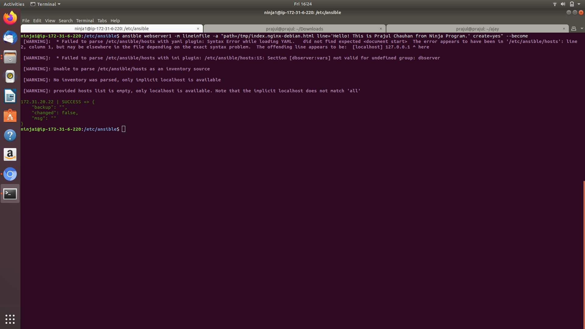	

	

	* Restart nginx service

	ansible webserver1 -m service -a "name=ninja state=restarted" --become

	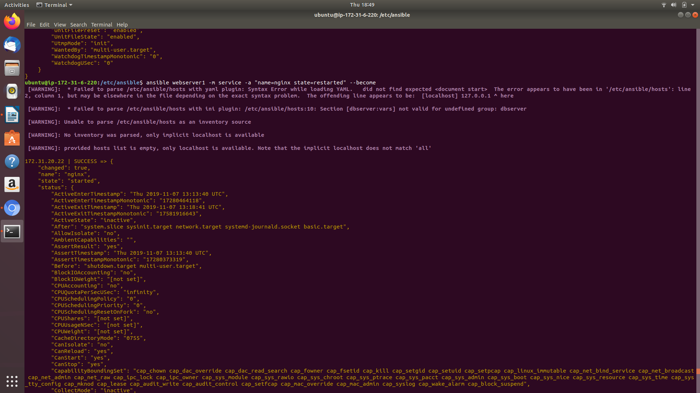

## Must Do 
* Install *python3* on your machine.

	
	ansible webserver1 -m apt -a "name=python3 update_cache=yes state=latest" --become

	
	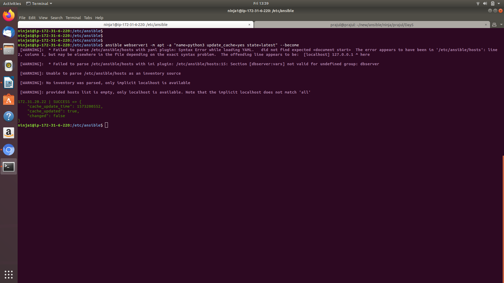

* Print operating system of your machine.

	ansible webserver1 -m setup -a "filter=*os*"

	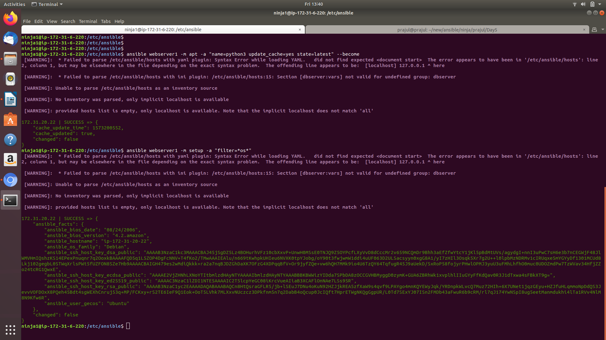

* Install *nginx*.

	ansible webserver1 -m apt -a "name=nginx update_cache=yes state=latest" --become

	
	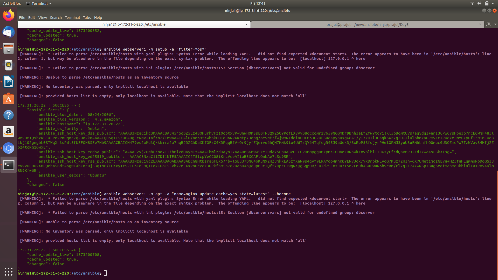

* Host *https://github.com/cloudacademy/static-website-example* via *nginx*.

	ansible webserver1 -m git -a "repo=https://github.com/cloudacademy/static-website-example version=master dest=/var/www/html/git accept_hostkey=yes" --become

	

	

* Host above website as *opstree.com*, make sure the logs should be stored as */var/log/nginx/opstree.com.access.log* and */var/log/nginx/opstree.com.error.log*

	
	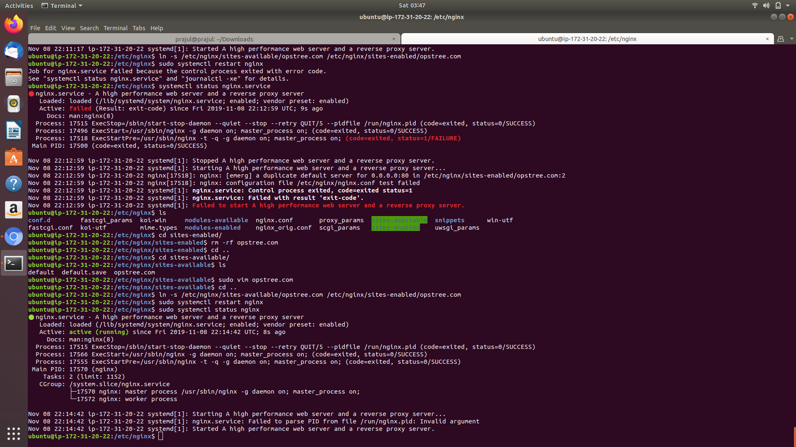

	

	
	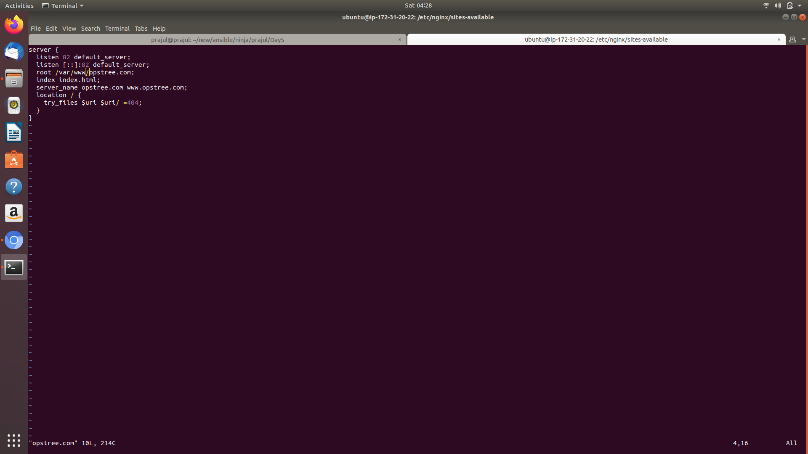

* Host abvoe website as *techprimosoultions.com*, make sure the logs should be stored as */var/log/nginx/techprimosoultions.com.log* and */var/log/nginx/techprimosoultions.com.error.log*
* Make sure that the hosted website is accessible only from *localhost*
* Create a utility that will run every morning at 9:30 am that will clean up the nginx logs.

## Good to do
* Uninstall python from your machine.
* Install *python3* on your machine.
* Uninstall nginx
* Install nginx using nginx binary or source code. Follow Linux best practices
